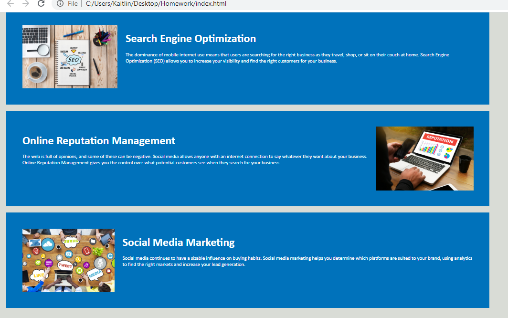

# Homework
Kait O'Shaughnessy's Homework for UPenn Bootcamp 

# Description
This is a webpage design for Horiseon, a company specializing in search engine optimization, online reputation management, and social media marketing. 

# Features
This website allows visitors to use the navigation bar to select 'Search Engine Optimization', 'Online Reputation', or 'Social Media Management' and to be be redirected to the coinciding paragraph of information for each topic displayed in the main content area of the webpage: 

Navigation bar display:

Main informational content linked to the nav bar:

Visitors can learn about the benefits of using Horiseon by reading the information on lead generation, brand awareness, and cost management in the sidebar:

The footer at the bottom of the page denotes the webage design by Horiseon, as well as the copyright and Inc.:

Link to the deployed application: 

[Horiseon application link](https://kaito47.github.io/Homework/)